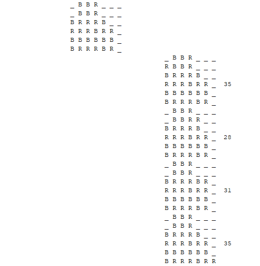

## Problem To Be Solved

It required to provide an AI agent to play connect-four game against a human till the board is full and the winner is one who has a greater number of connect fours.
This kind of game search problem needs adversarial search algorithm and here we use minimax algorithm to help the agent to choose the best current move by searching a tree for the coming movies to choose the best scenario for it -the one which increases our possibilities and decrease opponents possibilists.
Searching in such great tree could be impossible because the amount of memory and time it needs, so we must find some evaluation function that give us some estimate for how good the state is for us without needing to traverse till the leaves of the tree.
The game should take K as a parameter before beginning the game.
We also required to make a full game with GUI where we choose whether to use alpha-beta pruning or not in AI agent then play against the
agent till the board is full.

## Possible Solutions

First we need to find and make some good evaluation functions to test and compare between them for the best.
1. Evaluating each position to choose the best one for example the middle column of board can be the best position because it gives you many possibilities to connect four pieces horizontally diagonally and vertically.
And we can evaluate the score of the state we sum the scores given by each column in this state.

But we found out this heuristic isn’t good in our situation because this aims to connect four pieces quickly and preventing the opponent from doing so and this is not a good strategy for winning full board connect-four. It better to occupy the board than making on connect four even if this mean you will let your opponent be one step before you. After testing this algorithm the conclusions were as expected. Even knowing that the agent has got the advantage over the human by knowing and calculating the possibilities after more than one turns the game was ending in a draw and in some cases the human can win.

2. Now we came to a better logic and strategy that came from better way of evaluation. We decide to evaluation each state according to the number of connect fours and number of connect threes and also the number of connect twos because all of these can give us a further vision for how the after state could be. And we gave each of them a score for example if agent make one connect four the score increases by 10 points and if he makes one connect three and the fourth position must be empty of course then it increases by 5 points.

Score for red = 5 + 2 + 2 + 2 – 5 -2 -2 -2-2 =-2

Obviously by looking at this heuristic we can notice that the agent could waste a chance of increasing the number of connect fours by one to make a better move which help him to occupy the board preventing his opponent and increase his chances in future moves.
After testing this algorithm, the agent become undefeatable and barely the game can end in a draw state in the case of very low K values like 2.

## Assumptions & Other Details

We assume for our heuristic function that the connect fours increases state value by 10 points and three connects with empty fourth increase by 5 and two increases by 2. Of course, we test all this cases in all directions horizontal, vertical and two diagonals. We can see that these numbers aren’t rule or mandatory and it measures no thing it just give us a good estimate for how close we are to win by measure the connect fours and also the near connect fours so it’s totally admissible heuristic evaluation and we can change these numbers, but it should be realistic and a little bit close to each other and of course the points for 4> for 3 > for 2.
When we test different values for these points, we found out that if we increase the value for the connect fours far away the agent will tent to make connect fours and block opponent rather than occupy the board and this is like what happen when we test the other evaluation function. So, we came out with conclusion that these values we assume are good and give almost perfect results and also we use the other conclusion for this big value of connect four in some feature we will talk about later.
-We choose the first player to go using random function which randomly choose 1 or 2 and according to it the human or agent goes first. We found out that also the agent wins all the game played whether it goes first or not but if he starts first the different of scores after winning increase because seeing the board empty gives it advantage over the human to occupy the board and holding back his movements.
-We combine minimax algorithm in one function by passing a parameter to it to know whether it is maximizing or minimizing the next step. And we will discuss more about it later in functions section.
-We didn’t need a tree to save any nodes or any values and we depend on the recursion for this as we generate the children of each node using loop and we call the minimax algorithm for each of these children inside the loop so we recursively take the children of nodes first (DFS).

## More Feature

1-We prepare a main menu GUI before the game for better control over all features and different modes we support

2.Our game support Different modes for playing for example you can either play against your human friend in multiplayer mode or play with AI agent with different levels of difficulties.
you can play either normal connect four which ends after the first one manages to connect four or the fully board mode.
3.We don’t only print the tree of each step till the k level but also, we print the evaluation of these nodes to make it easy to trace the code

## Important Functions

   

     public boolean isTerminal(char[][] node)

It takes the node or the current state of the board an see weather it’s a leaf node or not. And there are two cases:
-If the player chooses to play fully board mode, the function checks that there is no empty space on the board.
-If the player chooses to play first connect mode, the function checks if the there is one connect four in the board.
This function is used inside minimax function.

    public int countConnectFour(char[][] board, char piece)
    public int countConnectThrees(char[][] board, char piece)
    public int countConnectTwos(char[][] board, char piece)

Those functions count the number of connects to use them to evaluate the state and those functions take most of time because they loop over the board many times in many directions and orders.

	public int eval(char[][] board)
It returns an estimator of the value of the state by multiplying each number of connects by some factor that could be called a weight for this connect.
Here also there are two cases:
-If the player chooses to play fully board mode, the function multiplies the 4 connects by 10 points because it is likely equally for it to make a connect of four or make two connects of three which helps for further moves so it wouldn’t be shocking if you find the agent ignore some easy connects of four because it will always win at last.
-on the other hand, if the player chooses to play first connect mode, the function will multiply the connects of four for you by much greater number let’s say 100000 because he just has to connect four as soon as possible and block any chance of fours for opponent.

	public pair minimax(char[][] node, int depth, boolean maximizingPlayer ,boolean pruning, int alpha, int beta)
This is the most important function and the backbone of the whole code.
It applies maximizing and minimizing searching algorithm to search for the best path to win.
This function take 6 parameteres, the node state, the depth of this node from the current node state and this number increases recursively and the function will return evaluation of node if either case happen (we reach the terminal or we dig deeper till depth equals k), a Boolean variable that will determine wether
this function acts as minimizer or maximizer for state, another Boolean variable to determine weather to prune the tree or not according to the users needs and last the alpha and beta values which won’t be used if there is no pruning.

## Manual of Use

First thing you will face after opening the application is the main menu interface which is clear and ease to use.

The player/s can choose different name for themselves inside the game. If they decide to write nothing and found this waste of time the game will choose their names as player1 and player2.
-Then The user code chose the dimensions of board and notice that if he chooses numbers less than four the game will probably end draw.
-Their default values are 6x7 for non-given inputs.
-Then the player chooses the value of k from one to ten from a combo box and the combo box is the best use case in this situation because the program will take very large time if we increase its value a lot, so the design is consistent for users.
After beginning the game the user choose the column to play and can click any where in this column and the piece will be dropped in the correct place.
-After the end of the game the is a panel appears to show the winner and the scores.
-It’s important to mention that we didn’t add a panel or any text to show whose turn is the current one because it would take a non-required place and we solve problem of space in screen and problem of confusion we make the empty positions colored with player turn color on hover.

## Used Data Structures

**Array List** 
to store the components of the JFrame of the GUI to do some processes on them later.
**Pair**
Made data structured class used inside minimax algorithm.
It stores 2D char array(node) and an integer(utility).

## Recommendations For Further Improvements

Add some label or panel to show the score each turn during the game so that we don’t need to count and don’t need to wait till the end of the game.
-For Interaction design approach, it would be better to add any GIF or an indicator to show the player that the computer is thinking in case of long waiting for large k values. This would achieve feedback factor (increase usability)
-Chose the color of the pieces no only red and blue using global variables
